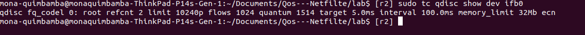
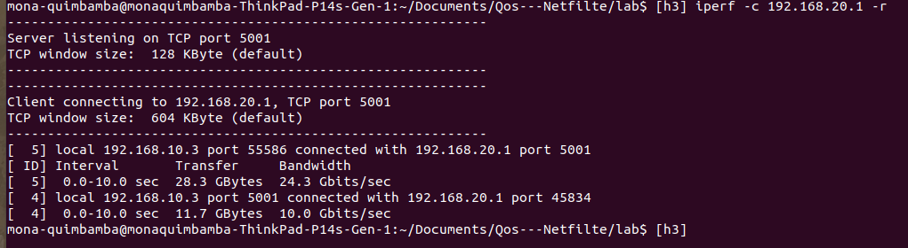
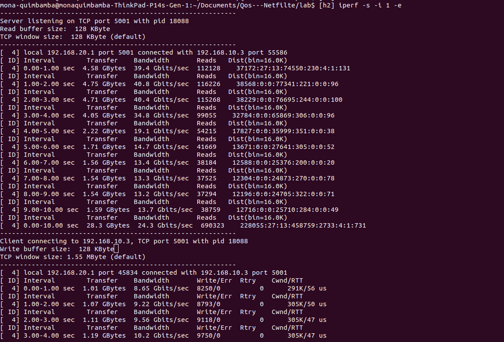
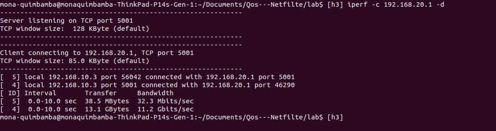
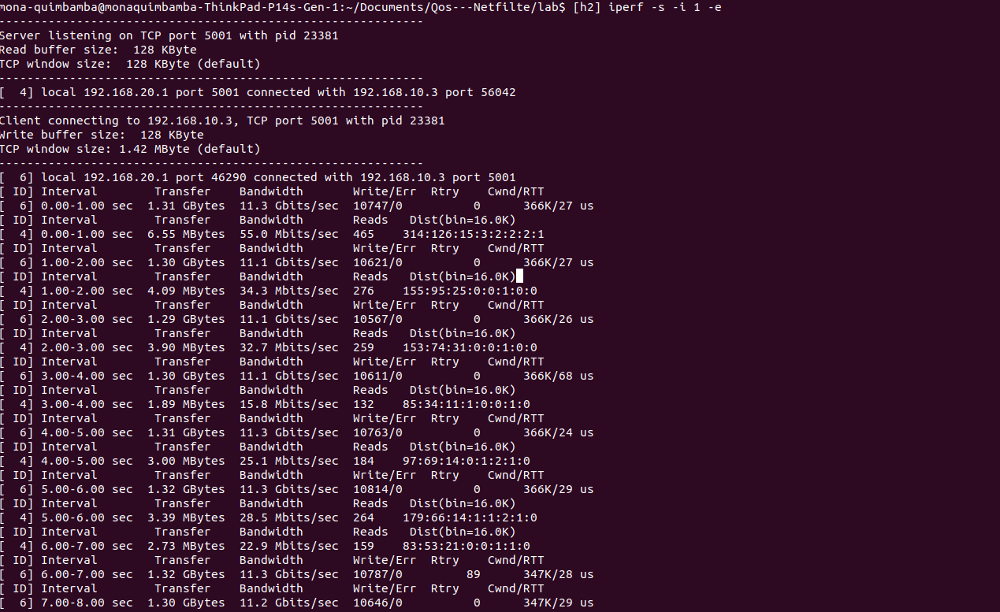

# QoS et trafic entrant igress


## Intermediate Functional Block

c'est une pseudo-interface qui agit comme un concentrateur de QoS pour plusieurs sources de trafic différentes. Les paquets en provenance ou à destination d'autres interfaces doivent être redirigés vers elle en utilisant l'action miroir afin d'être traités, le trafic routé régulièrement sera abandonné.

 De cette façon, une seule pile de qdiscs, classes et filtres peut être partagée entre plusieurs interfaces

 - chargement du module noyau ifb

 ```modprobe -r ifb```
 - par default il aura deux interface ifb0 et  ifb1 donc on demande à avoir une seul interface la ifb0

 ```modprobe ifb numifbs=1```

 - ajouter i'interface ifb0 au manespace r2

 ```ip link set ifb0 netns r2```

 - cela va activer l'interface ifb0 qui est sur r2

 ```ip netns exec r2 ip link set ifb0 up```

 - créer une entrée sur interface externe r2-eth1

 ```ip netns exec r2 tc qdisc add dev r2-eth1 ingress handle ffff:```

 - Transférer tout le trafic entrant dans le routeur r2  vers le module ifb

 ```ip netns exec r2 tc filter add dev r2-eth1 parent ffff: matchall action mirred egress  redirect dev ifb0```


### la commande :

```sudo tc qdisc add dev ifb0 root red limit 10000 min 8000 max 9000 avpkt 100 burst 81 harddrop adaptive bandwidth 10Mbit```

cette commande va gerer la file d'attente en effectuant une chute de la file d'attente de maniere progressive, de façon
à avoir une petite taille de la file d'attente


## Mesures :

Serveur : h2

Clients : h1 ou h3

paquets entrant dans r2 :


## avec iperf en TCP sans l'application de cette qdisc

la qdisc par default qui est sur r2




Client :





Serveur :

Reception d'un paquet à chaque 0.5



## avec iperf en TCP avec l'application de cette qdisc


Client :





Serveur :

Reception d'un paquet à chaque 0.5



## avec iperf en UDP avec l'application de cette qdisc
