# QoS et trafic entrant igress


## Intermediate Functional Block

c'est une pseudo-interface qui agit comme un concentrateur de QoS pour plusieurs sources de trafic différentes. Les paquets en provenance ou à destination d'autres interfaces doivent être redirigés vers elle en utilisant l'action miroir afin d'être traités, le trafic routé régulièrement sera abandonné.


 - chargement du module noyau ifb

 ```modprobe -r ifb```
 - par default il aura deux interface ifb0 et  ifb1 donc on demande à avoir une seul interface la ifb0

 ```modprobe ifb numifbs=1```

 - ajouter i'interface ifb0 au namespace r2

 ```ip link set ifb0 netns r2```

 - cela va activer l'interface ifb0 qui est sur r2

 ```ip netns exec r2 ip link set ifb0 up```

 - créer une entrée sur interface externe r2-eth1

 ```ip netns exec r2 tc qdisc add dev r2-eth1 ingress handle ffff:```

 - Transférer tout le trafic entrant dans le routeur r2  vers le module ifb

 ```ip netns exec r2 tc filter add dev r2-eth1 parent ffff: matchall action mirred egress  redirect dev ifb0```


### la commande :

```sudo tc qdisc add dev ifb0 root red limit 10000 min 8000 max 9000 avpkt 100 burst 81 harddrop adaptive bandwidth 10Mbit```

cette commande va gerer la file d'attente en effectuant une chute de la file d'attente de maniere progressive, de façon
à avoir une petite taille de la file d'attente


## Mesures :

Serveur : h2

Clients : h3

paquets entrant dans r2 :


## avec iperf sans l'application de cette qdisc


### TCP

Nous remarquons que la Bande passante bidirectionnelle simultanée est en giga qui implique un débit éléve.

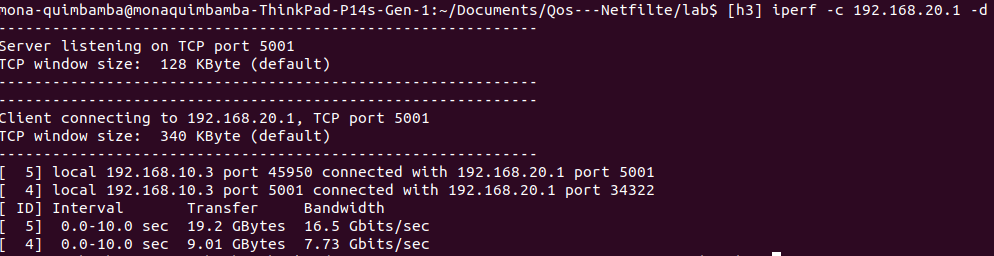

On remarque les segment dupliques <   
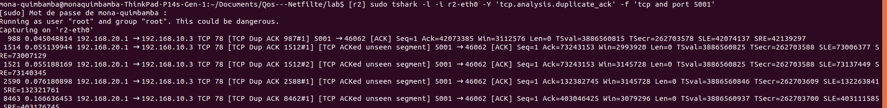

### UDP
Nous remarquons également que nombre de paquets perdus dans cette capture
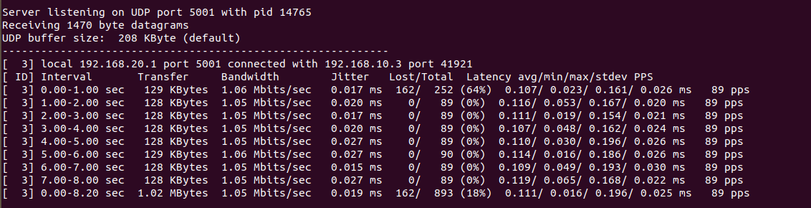

la statistique de la qdisc sur r2
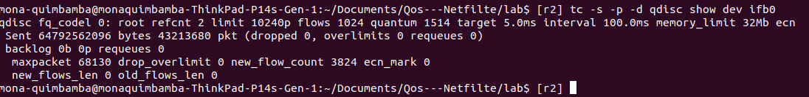


## avec iperf avec l'application de cette qdisc


### TCP
on remaque que la bande passante a reduit dû au fait de l'application de la qdisc  
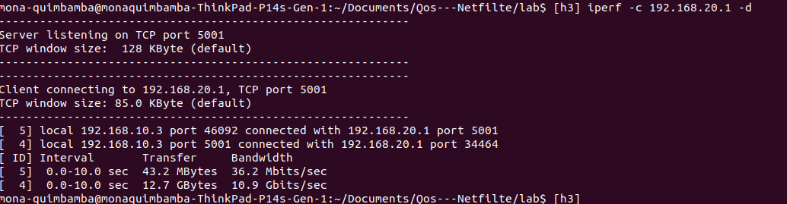


### UDP

On remarque qu'il n'y a pas des perdes de paquets

Client UDP           |  Serveur UDP
:-------------------------:|:-------------------------:
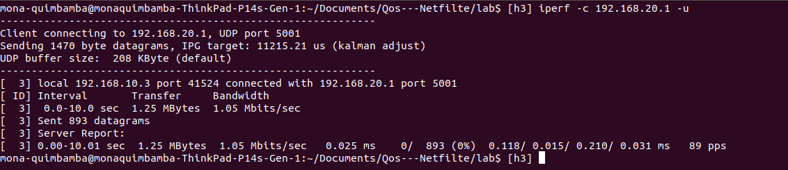  |  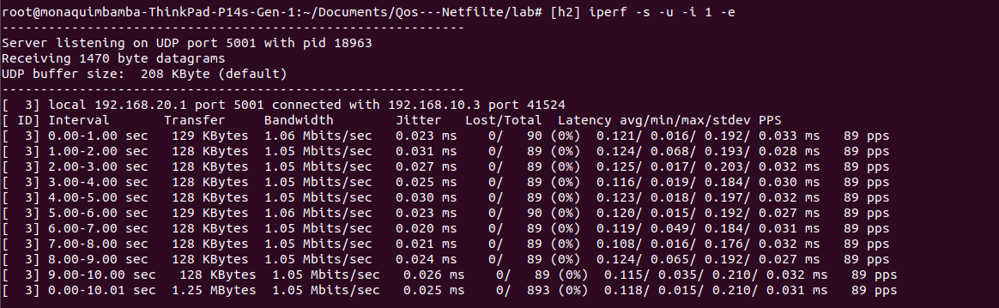


Il existe beaucoup plus de paquets duplique avec la qdisc
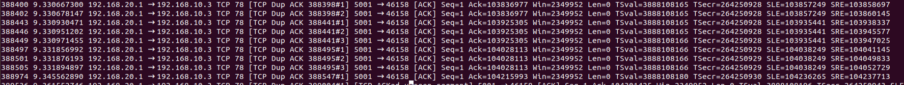


la statistique de la qdisc sur r2
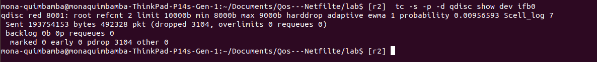


## QoS en ingress et classification par TOS


           1: root qdisc
      /    |   \
      /    |   \
      /    |    \
      1:1  1:2  1:3   classes
      |    |     |
      10:  20:   30:    qdiscs qdiscs
      sfq  tbf   tbf

Le filtre sera appliqué que à la classe 1:1 et 1:3 avec la tos 0x10 et 0x08, les
paquets par default vont vers la racine .

Voici une stat du nombre de paquets qui ont été traité par les différentes feuilles et par la racine :

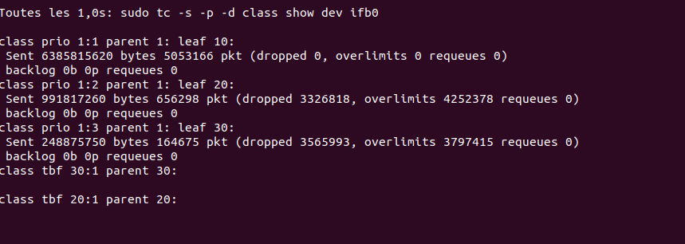


On remarque qui cette methode est plus efficace que précédemment  car on peut rediriger le flux de données où on veut et donc on pourrai mieux traiter ar exemple si on a un serveur criquité sur notre réseau on peut rediriger le trafic vers ce serveur sur une classe et ensuite prétraiter les données entrantent


## QoS et « traffic Shaping »


                 1: root htb
                 |
                 |
                1:1 classe qdisc
             /    |   \
          /       |    \
        1:10    1:20    1:30 classe qdisc htb


le filtre ici est applique pour les trois feuilles 1:10 à 1:30, mais la classe qui aura le plus de redirection
voici la caputre de la stat où on voit qu'une fois que cela passe par  la racine le  noeud 1:1 recoit la plupart du traffic , et ensuite le traffic va vers la feuille 1:10,
qui a le plus grand débit parmis les trois feuille.
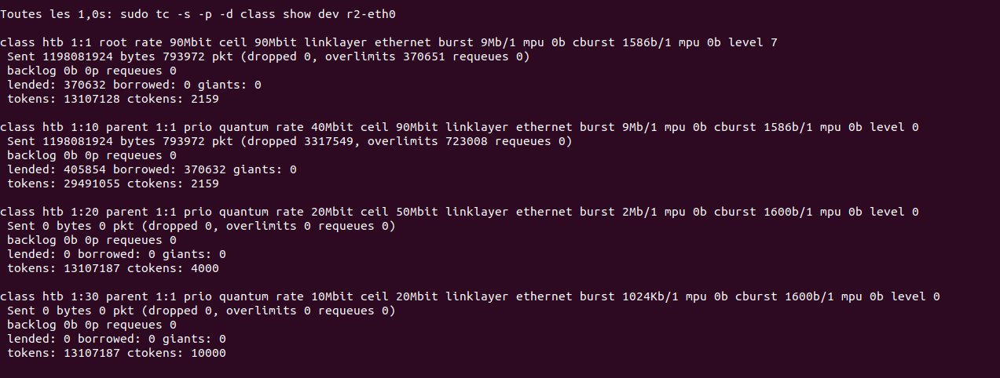


Les régles du firewall à appliquer sur r1 :

pour les classes sont :

pour la classe 1 :
- iptables -A PREROUTING -t mangle  -j MARK --set-mark 1

pour la classe 2 :
- iptables -A PREROUTING -t mangle -j MARK --set-mark 2

pour la classe 3 :
- iptables -A PREROUTING -t mangle -j MARK --set-mark 3


## QoS à la demande

Résultat du programme python 
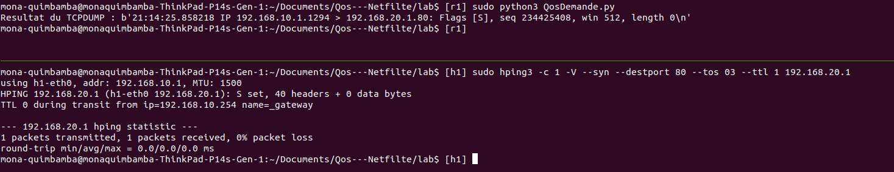
